# GeekReel AI Studio

**本地优先的一站式 AI 视频工作台**  

热点雷达，抖音、知乎、微博等主流平台热点内容直接点击生成相关视频；分集制作、流水线一站式视频生成。

不夹带任何私货，没有账号，没有云端成片库，项目、素材、密钥都在本机。

**[中文](#geekreel-ai-studio)** · **[English](#english)** · [设计文档 / Design](docs/design.md) · [许可 / License](LICENSE)

---

<p align="center">
  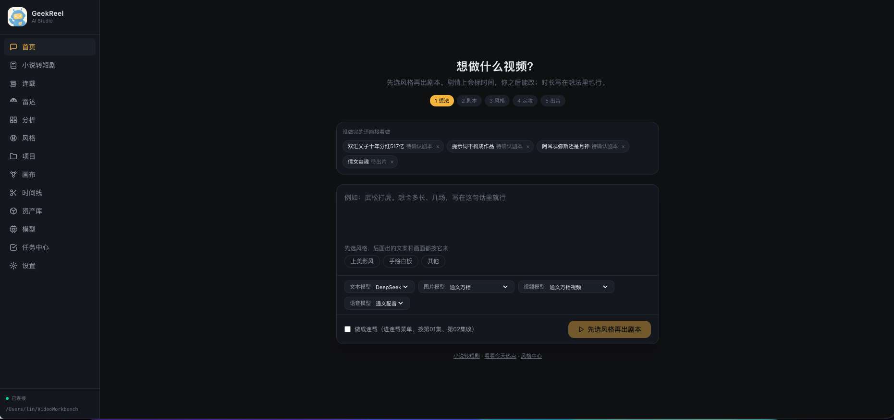
</p>

GeekReel AI Studio 跑在你自己的机器上。没有账号，没有云端成片库。项目、素材、密钥都在本机；生成任务走你自己配置的模型端点。

它不是又一个在线剪辑网站，也不是绑定单一厂商的「一键出片」盒子。定位是：

> 把「找选题 → 分析爆款 → 攒素材 → AI 生成 → 剪辑合成 → 导出」放进同一个本地工具。目标用户是不会剪辑、也不想写提示词的人；画布、时间线、模型中心随时可深入，但不挡在新手路上。

当前版本 `0.1.1`。功能以本仓库实现为准，本版说明见 [`CHANGELOG.md`](CHANGELOG.md)，架构见 [`docs/design.md`](docs/design.md)（v0.16）。

## 为什么值得看

| 亮点                | 实际做法                                                                                        |
| ----------------- | ------------------------------------------------------------------------------------------- |
| **本地优先**          | 无登录。SQLite 在 `~/.video-workbench`，素材在你选的文件夹（默认 `~/VideoWorkbench`）。换机器拷仓库即可跑。               |
| **模型自己配**         | 文本 / 图片 / 视频 / 语音都是「适配器 × 端点」。点一下填密钥就能加上通义、DeepSeek、GPT、可灵、豆包、MiniMax 等；也支持自定义 OpenAI 兼容地址。 |
| **风格是目录，不是写死的皮肤** | 内置「上美影风」和「手绘白板」。第三套 = 往 `stylePacks/` 丢一个包，或贴 GitHub 技能链接 / 上传 `SKILL.md` / zip。做好的包可以带走。   |
| **首页像对话，不是空白工程**  | 「想做什么视频？」→ 选风格 → 出剧本 → 定妆 → 出片。没做完的作品会停在任务中心，点回去接着做。                                        |
| **配音按成片、对白对嘴**    | 字幕可以自动装上。配音要人选音色。对白先出语音再对口型，旁白只铺声；5 秒片子不会念整份 30 秒剧本。通义 / OpenAI / MiniMax / 豆包音色目录都会列出。 |
| **成本看得见**         | 模型页按近 30 天汇总调用次数、tokens、张数、秒数和花费。单价填错就记 0，不猜。                                               |
| **媒体工具随仓库走**      | ffmpeg / ffprobe 用项目依赖；yt-dlp 按当前系统下载独立二进制。不要去装 pipx，也不要依赖开发机 PATH。                         |

## 一张图看清工作流

```
热点雷达 / 小说 / 一句话想法
        │
        ▼
   剧本（可改、可批注）
        │
        ▼
   风格包（上美影 / 白板 / 自带包）
        │
        ▼
   定妆 / 关键资产 ──► 画布（可选，节点连线）
        │
        ▼
   出片（任务队列，离开页面也继续跑）
        │
        ▼
   时间线：字幕 · 选音色 · 对白对嘴 · 配乐/环境底/音效
        │
        ▼
   导出 MP4（可烧字幕）──► 资产库
```

## 界面

### 首页：一句话开工

打开就是输入框和模型选择。先选风格再出剧本；刷到一半关掉，下次还能接着做。

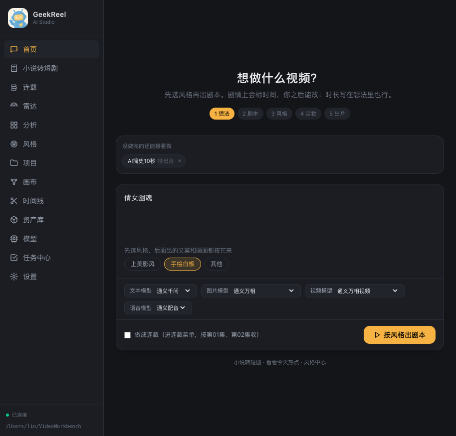

### 定妆后出片

风格约束会进提示词。白板走文生视频，不是拿一张图去图生视频。确认定妆后再批量出片。

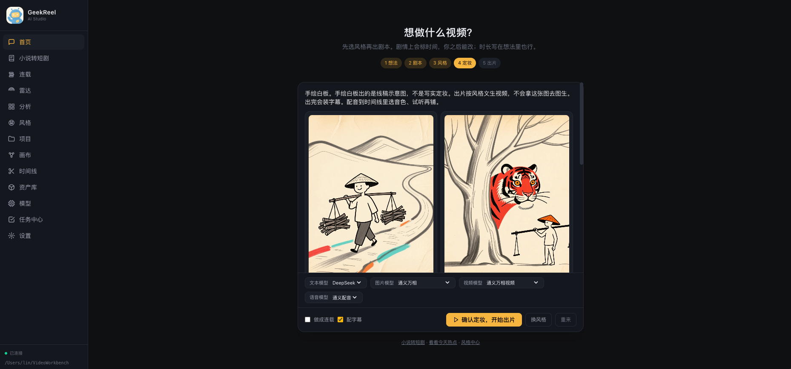

### 时间线：选音色、试听、再配音

画面和字幕出片后自动装上。配音要人点。对白镜先配音再对嘴，旁白只铺声。可铺配乐、环境底、音效，导出剪映草稿。竖屏默认 1080×1920。

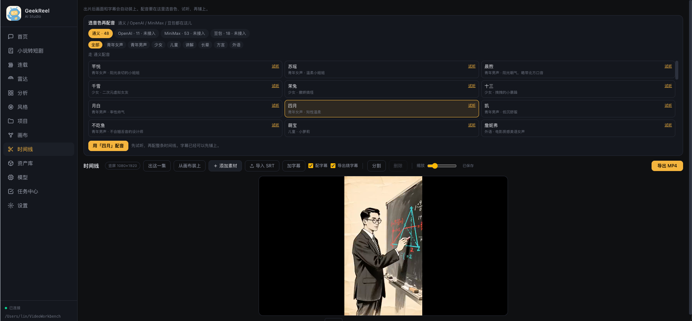

### 烧进成片的字幕

按口播切成短句，按镜头窗口铺开；ASS 按成片分辨率写 `PlayRes`，避免字幕撑满半个画面。

<p align="center">
  
  &nbsp;
  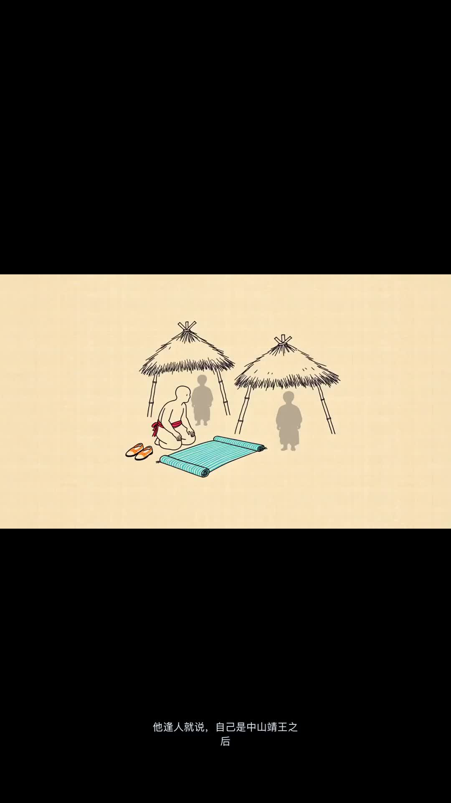
</p>

### 模型中心与 30 天花费

常用模型点一下填密钥。右上角可自定义端点，或从环境变量导入。

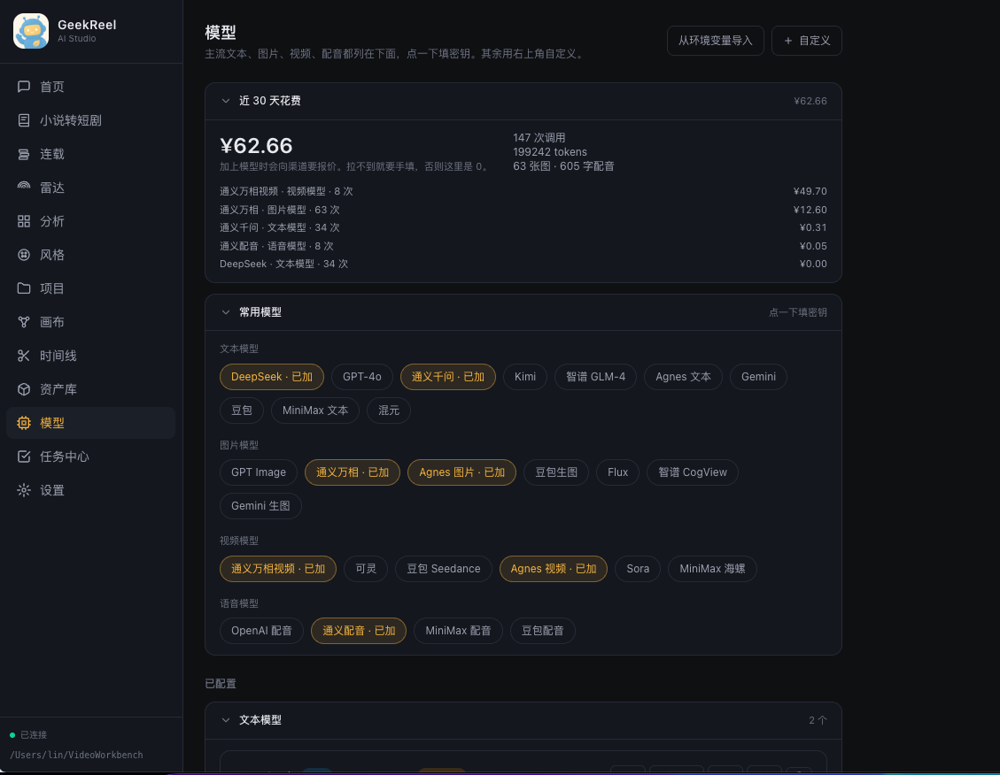

### 任务中心

生成、索引、导出、雷达刷新都进同一条队列。可取消、重试。没做完的片子会提示回首页接着出。

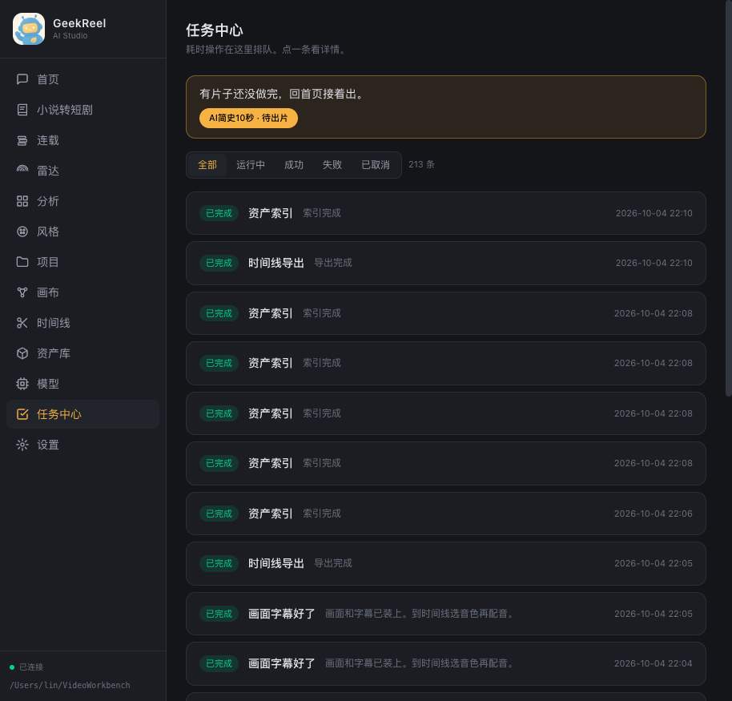

### 资产库

统一文件夹，按作品 / 类型浏览。网格或列表；按用途、来源筛选。点视频可以走「复刻爆款」。

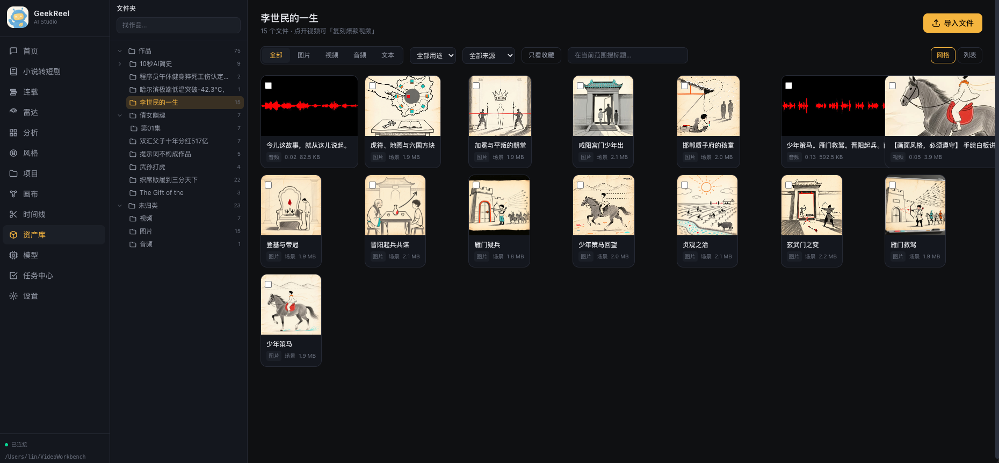

### 风格中心

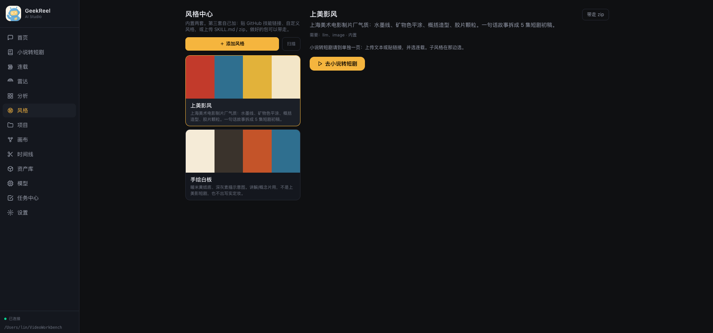

### 热点雷达

用已配置的联网文本模型查微博 / 抖音 / B 站 / 知乎 / 小红书。热度是模型估计，界面会标明，不是官方榜。点「做成视频」进首页向导。

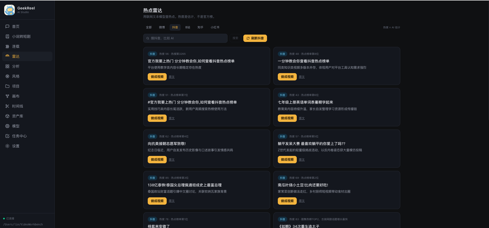

### 竞品分析

粘贴抖音 / B 站 / YouTube / TikTok 链接，或从资产库选视频。下载、抽帧、转写、拆钩子和节奏。勾 2–4 份报告可并排对比。抖音经常拉不下来——自己保存后导入资产库即可。

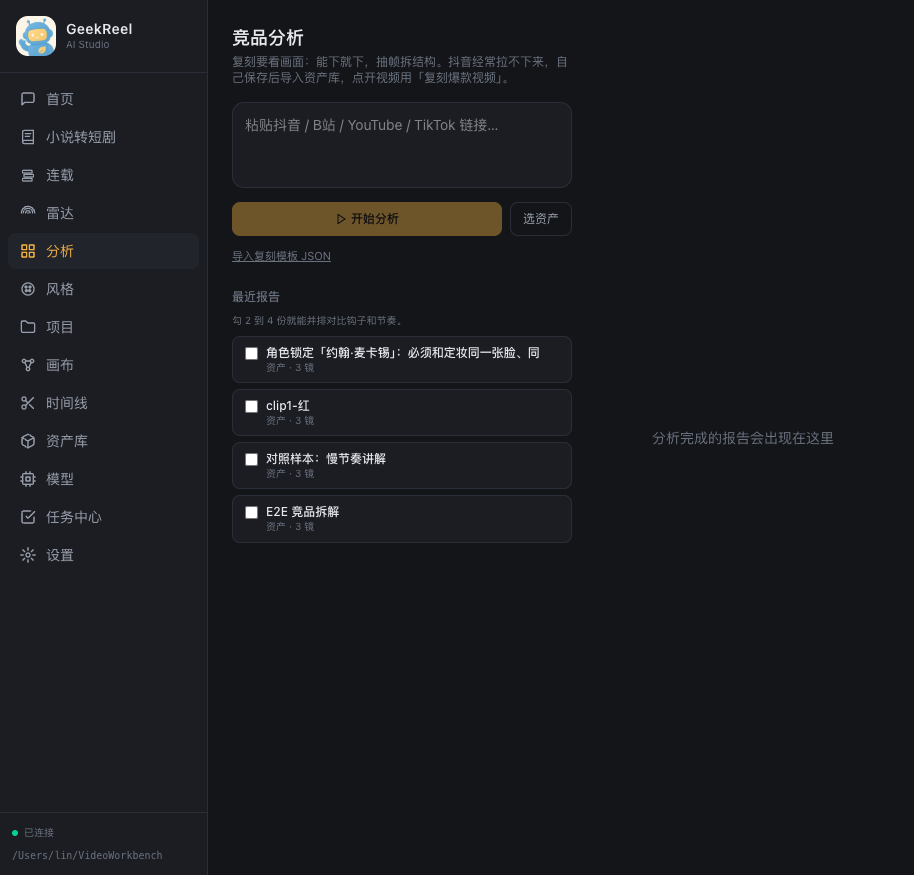

### 小说转短剧 · 连载

上传 `.txt` / `.md`、贴能打开的链接，或粘贴正文。先出人物档案和事件清单，可整份对话改（例如「全部改成中文」），单条也能点开改。勾连载后出现在连载页，下一集锁同一套风格和人物。

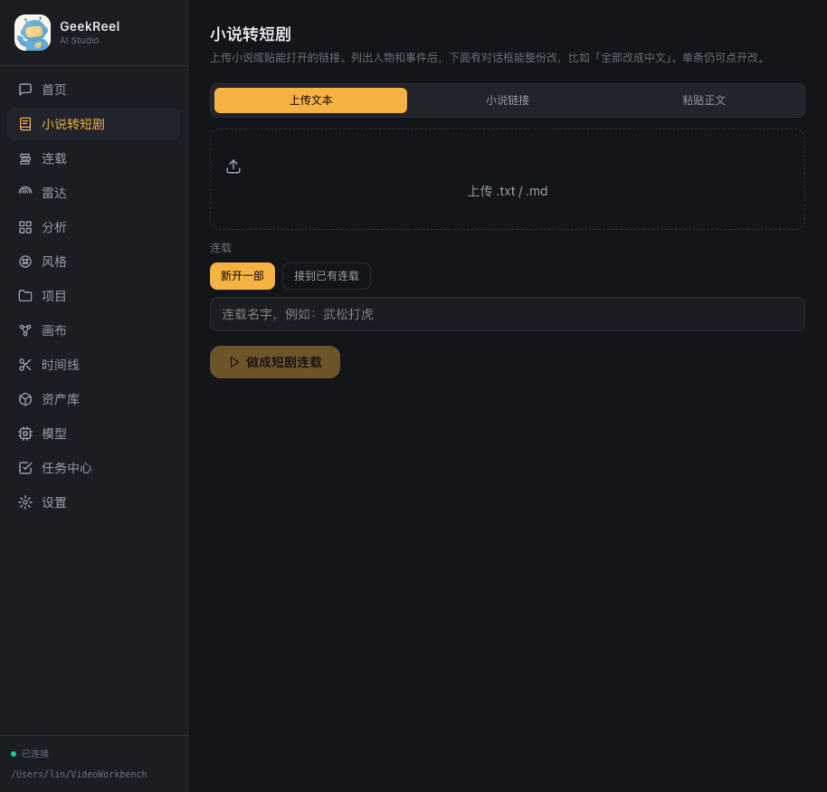

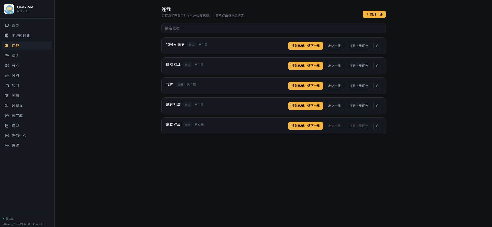

### 项目 · 画布 · 设置

一个项目 = 一个本地目录。画布用节点连线（文本 / 分集 / 场景 / 分镜 / 文生图 / 文生视频 / 配音 / ffmpeg）。设置里改主题、中英文、资产库目录；没有账号。

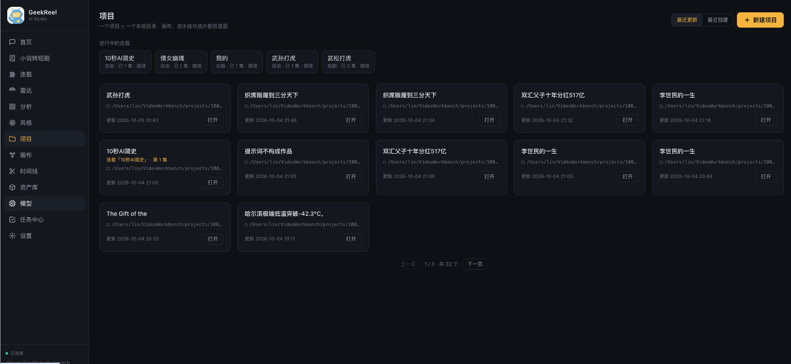

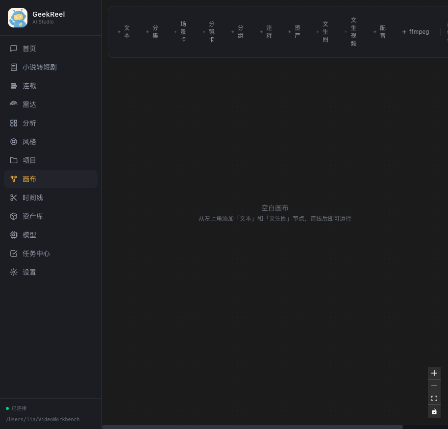

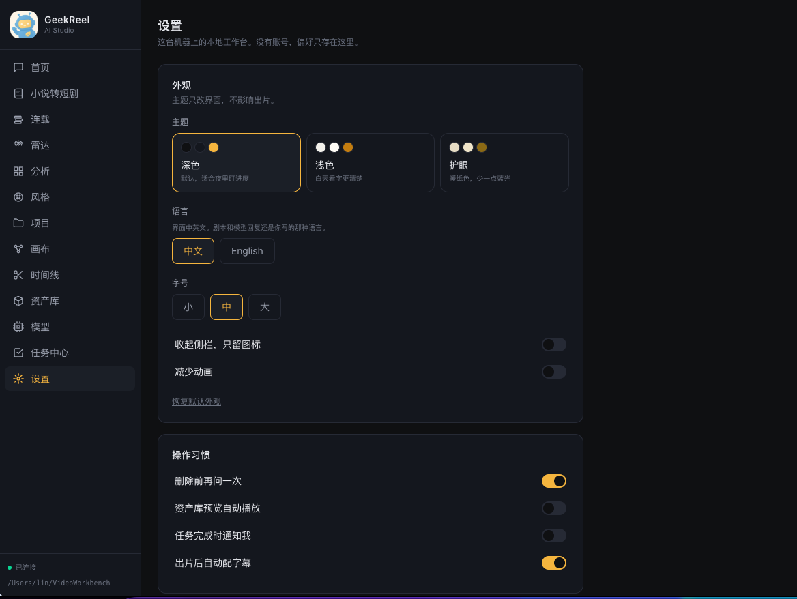

## 功能清单

### 创作

- **引导式首页**：想法 → 剧本 → 风格 → 定妆 → 出片；未完成作品可搁置、恢复。
- **小说转短剧**：通读全文 → 角色档案（外貌 / 性格 / 身份 / 穿搭）→ 事件清单 → 确认后再拆集。
- **连载**：多部并行；定妆照锁进后续集数的提示词与参考图。
- **风格包**
  - **上美影风**：上海美术电影制片厂气质；子风格含手绘平涂、石蓝淡墨、水墨淡彩、剪纸、敦煌重彩。色盘与风格咒语由引擎注入，不靠人手复制。
  - **手绘白板**：暖米黄纸底、深灰素描。讲解 / 概念片用；出片走文生视频。
- **画布**：无限画布，连线即数据流，整链运行，产物回落资产库。
- **时间线**：视频轨 + 人声 / 配乐 / 环境底 / 音效 + 字幕；对白按成片写词并对嘴；变速 0.5×–2×、淡入淡出；从画布一键装配；导出 MP4 或剪映草稿。

### 选题与复刻

- **雷达**：AI 查询源 + RSS / HTTP API；关键词订阅；Webhook / Server酱 / Telegram / Bark / 邮件。
- **分析**：yt-dlp 下载 → ffmpeg 抽帧 → Whisper 转写 → LLM 结构报告（钩子 / 节奏 / 分镜 / 台词）。文本端点勾选「能看图」时会把帧送进去。
- **复刻**：报告转槽位模板，换主题 / 人物 / 语言后批量变体；模板可导出 JSON 再导入。

### 资产与工程

- 资产按 `类型/年月/日期_标题_hash` 落盘，库内相对路径，换根目录可迁移。
- 标签、收藏、用途（角色 / 场景 / 道具）、来源（导入 / 画布 / 流水线 / 复刻 / 分析 / TTS）。
- 删除前检查画布 / 时间线 / 复刻引用。
- 任务队列：内存排队 + SQLite 持久化，WebSocket 推进度。

### 模型

预置端点（填密钥即可，也可改 URL / 模型名）：

| 能力  | 预置                                                          |
| --- | ----------------------------------------------------------- |
| 文本  | DeepSeek、GPT-4o、通义千问、Kimi、智谱 GLM、Agnes、Gemini、豆包、MiniMax、混元 |
| 图片  | GPT Image、通义万相、Agnes、豆包、Flux、CogView、Gemini                 |
| 视频  | 通义万相、可灵、豆包 Seedance、Agnes、Sora、MiniMax 海螺                   |
| 语音  | OpenAI、通义、MiniMax、豆包                                        |

适配器包括 OpenAI 兼容、DashScope 原生（图 / 视频 / TTS）、可灵、豆包 Seedance。密钥加密写入本机 SQLite，接口返回脱敏。

音色目录（时间线）：通义 48 · OpenAI 11 · MiniMax 53 · 豆包 18。未配置的厂商仍可浏览，不能试听 / 铺音。

## 快速开始

**环境**：已安装 [Bun](https://bun.sh)（1.2+）。macOS 已验证。Linux 在 `bun install` 时会按平台补 yt-dlp。不要依赖 Homebrew / pipx 里的 ffmpeg 或 yt-dlp。

```bash
git clone https://github.com/geekhome-lab/geekreel.git
cd geekreel
./scripts/dev.sh
```

- 网页：[http://127.0.0.1:5473](http://127.0.0.1:5473)
- API / WebSocket：[http://127.0.0.1:4780](http://127.0.0.1:4780)（开发态由 Vite 代理 `/api` 与 `/ws`）

只跑成品（先编网页，再由服务托管静态资源）：

```bash
./scripts/start.sh
```

浏览器打开 [http://127.0.0.1:4780](http://127.0.0.1:4780)。

第一次打开：到 **模型** 页加上文本、图片、视频（配音可选）端点，再回首页写想法。没有密钥时界面会引导去配置，而不是甩一堆报错栈。

### 目录

| 路径                    | 内容                                        |
| --------------------- | ----------------------------------------- |
| `~/.video-workbench/` | SQLite、加密密钥、雷达缓存、风格包索引                    |
| `~/VideoWorkbench/`   | 默认资产库（设置里可改，改时可选迁移）                       |
| 项目目录                  | `project.vw.json`、画布快照、流水线状态、`export/` 成片 |

端口可用环境变量覆盖：`VW_HOST`、`VW_PORT`（默认 `127.0.0.1:4780`）。ffmpeg 可用 `VW_FFMPEG` 覆盖自带二进制。

### 换机器

整份仓库拷走。`./scripts/dev.sh` 或 `./scripts/start.sh` 会 `bun install` 并使用仓库内的 ffmpeg / yt-dlp。数据在 `~/.video-workbench` 与资产库目录，需要的话一并拷。风格包 zip 可在风格中心导出后再上传。

## 仓库结构

```
video_workbench/
├── apps/
│   ├── server/          # Bun + Hono：REST、WebSocket、任务队列
│   └── web/             # React 19 + Vite + Tailwind
├── packages/
│   ├── core/            # 共享类型
│   ├── models/          # 适配器与预置
│   ├── media/           # ffmpeg 探测 / 转码 / 烧字幕
│   ├── pipeline/        # 剧本、定妆、出片
│   ├── radar/           # 热点源
│   ├── analyze/         # 竞品分析 + yt-dlp
│   ├── remake/          # 复刻模板
│   ├── style/           # 风格包加载
│   └── push/            # 推送渠道
├── stylePacks/
│   ├── smy-animation/   # 上美影风
│   └── whiteboard/      # 手绘白板
├── scripts/             # dev.sh / start.sh
└── docs/
    ├── design.md
    └── screenshots/
```

```
浏览器 (React)
    │  REST + WebSocket
    ▼
Bun + Hono
    ├── 任务队列 (SQLite)
    ├── 模型网关
    ├── 流水线 / 雷达 / 分析 / 复刻
    └── ffmpeg · yt-dlp（仓库自带）
         │
         ├── ~/.video-workbench
         └── 资产库目录
```

## 使用边界（请先读）

1. **生成费用由模型厂商收取。** 本工具不代扣、不提供额度。成本看板依赖你在端点上填的单价。
2. **雷达热度是 AI 估计**，并尽量附带原文描述（如「热搜第 3」）。刷新需要带联网搜索能力的文本端点。
3. **部分平台视频下载会失败**（尤其是抖音）。分析页写明了：先存到本地，再导入资产库。
4. **配音不会在出片时自动铺上。** 这是有意的：先看画面和字幕，再选声音。对白镜点配音后会再对嘴。
5. **风格包改变的是提示词与流水线，不是保证每一帧都像样片。** 观感仍取决于你选的图 / 视频模型。
6. **默认只监听本机。** 若改 `VW_HOST` 对外网开放，请自行处理访问控制；密钥在本机库里。

## 开发

```bash
bun install
bun run typecheck
# 各包测试示例
bun test packages/pipeline/src/dialogue.test.ts
bun test packages/models/src/voices.test.ts
```

更细的模块约定、数据表和 API 前缀见 [`docs/design.md`](docs/design.md)。版本说明见 [`CHANGELOG.md`](CHANGELOG.md)。

## 许可

[Unlicense](LICENSE)。任何人都可以复制、修改、发布、使用、编译、出售或分发，不附加任何条件。软件按现状提供，作者不承担担保责任。

---

# English

GeekReel AI Studio is a **local-first** video workbench. There is no account and no hosted media locker. Projects, assets, and API keys stay on the machine you run it on. Generation calls go to **endpoints you configure**.

It is not a cloud editor and not a single-vendor “one-click film” appliance. The product thesis:

> Put topic discovery, competitor breakdown, asset intake, model generation, timeline assembly, and export in one local tool. The default path is a chat-like home wizard. Canvas, timeline, and the model center are advanced panels — available, never blocking.

Version `0.1.1`. Release notes: [`CHANGELOG.md`](CHANGELOG.md). Architecture: [`docs/design.md`](docs/design.md) (v0.16). Implementation in this repo is the source of truth.

## Why it is different

| Point                                      | What that means in code                                                                                                                                                                                  |
| ------------------------------------------ | -------------------------------------------------------------------------------------------------------------------------------------------------------------------------------------------------------- |
| **Local-first**                            | No login. SQLite under `~/.video-workbench`. Media in a folder you choose (default `~/VideoWorkbench`). Copy the repo to another machine and run.                                                        |
| **Bring your own models**                  | Text / image / video / speech are adapter × endpoint. One click + a key adds Qwen, DeepSeek, GPT, Kling, Doubao, MiniMax, and others. Any OpenAI-compatible base URL works.                              |
| **Styles are directories**                 | Built-in Shanghai Animation Studio look and hand-drawn whiteboard. A third style is a folder under `stylePacks/`, a GitHub skill URL, a `SKILL.md`, or a zip. Packs can be taken with you.               |
| **Home is a wizard, not an empty project** | Idea → style → script → looks → finish. Unfinished work stays in the job center and resumes on Home.                                                                                                     |
| **Dub from the clip, then lip-sync talk**  | Captions may attach after finish. Voices wait for you. Talking shots: TTS first, then lip-sync. Narration only lays audio. A 5s clip is not filled with a 30s script. Voice catalogs stay listed.     |
| **Spend is visible**                       | The Models page totals 30-day calls, tokens, images, seconds, and cost. A missing unit price records as zero — it does not invent a number.                                                              |
| **Media binaries travel with the repo**    | ffmpeg / ffprobe from package deps. yt-dlp as a platform binary, not a pipx shim and not your old `$PATH`.                                                                                               |

## Workflow

```
Radar / novel / one-line idea
        │
        ▼
   Script (editable, annotated)
        │
        ▼
   Style pack
        │
        ▼
   Looks / key assets ──► Canvas (optional node graph)
        │
        ▼
   Finish (job queue keeps running if you leave)
        │
        ▼
   Timeline: captions · voice · lip-sync talk · BGM / ambience / SFX
        │
        ▼
   Export MP4 (optional burn-in) ──► library
```

## Screenshots

<p align="center">
  
</p>

### Home

Open the app to a prompt box and model pickers. Choose a style, then a script. Unfinished work resumes later.


### Looks, then finish

Style constraints go into the prompts. Whiteboard uses text-to-video, not image-to-video from a still. Confirm looks before the batch run.


### Timeline: pick a voice, preview, then dub

Picture and captions attach after finish. Dubbing waits for you. Talking shots lip-sync from the voice; narration is overlay only. BGM, ambience, SFX, and Jianying export sit on the same page. Short drama defaults to 1080×1920.


### Burned-in captions

Spoken lines are split into short cues and fitted to the clip windows. ASS writes `PlayRes` at the export size so type does not fill half the frame.

<p align="center">
  
  &nbsp;
  
</p>

### Models and 30-day spend

Common models take a key. Custom endpoints and env-var import sit on the same page.


### Jobs

Generate, index, export, and radar refresh share one queue. Cancel and retry. Unfinished films send you back to Home.


### Library

One folder, browsed by work and type. Grid or list; filter by use and source. Open a video to remake it.


### Styles


### Radar

A web-search text model checks Weibo, Douyin, Bilibili, Zhihu, and Xiaohongshu. Heat is an estimate, labeled as such. “Make a video” opens the Home wizard.


### Analyze

Paste a Douyin / Bilibili / YouTube / TikTok link, or pick a library video. Download, frame, transcribe, then split hook and pacing. Compare 2–4 reports. Douyin often fails to download — save the file and import it.


### Novel to drama · Series

Upload `.txt` / `.md`, paste a readable URL, or paste the text. You get character files and an event list first. Edit the whole draft in chat (e.g. “rewrite in Chinese”) or open a single card. Mark it as a series to lock style and faces for the next episode.


### Projects · Canvas · Settings

A project is a local folder. Canvas wires text / episode / scene / shot / image / video / TTS / ffmpeg nodes. Settings cover theme, language, and the library path. No account.


## Feature set

**Create.** Guided home; novel → character dossier + event list → episodes; series that lock style and faces; reusable character / scene / prop looks; two built-in style packs (Shanghai Animation Studio with five substyles; whiteboard explainers via text-to-video); React Flow canvas; timeline with lip-sync dubbing, BGM/ambience/SFX, speed, fades, SRT, ffmpeg and Jianying export (default short-drama canvas 1080×1920).

**Discover and remake.** Radar via web-search LLMs plus RSS / HTTP APIs; push to Webhook / ServerChan / Telegram / Bark / SMTP. Analyze downloads with bundled yt-dlp, scene frames, Whisper, then an LLM report. Remake templates are slot JSON, variable-driven, batchable, import/exportable.

**Library and jobs.** Assets land at `type/YYYY-MM/MMDD_title_hash.ext`. Relative paths survive a library-root move. Deletes warn if canvas / timeline / remake still reference the file. Jobs persist in SQLite and stream over WebSocket.

**Models.** Presets cover the table in the Chinese section. Adapters: OpenAI-compatible, native DashScope (image / video / TTS), Kling, Doubao Seedance. Keys are encrypted at rest. Voice catalogs: Qwen 48, OpenAI 11, MiniMax 53, Doubao 18.

## Quick start

Requires [Bun](https://bun.sh) 1.2+. Verified on macOS. `bun install` fetches a matching yt-dlp for the current OS. Do not depend on Homebrew or pipx copies of ffmpeg / yt-dlp.

```bash
git clone https://github.com/geekhome-lab/geekreel.git
cd geekreel
./scripts/dev.sh
```

- UI: [http://127.0.0.1:5473](http://127.0.0.1:5473)
- API / WS: [http://127.0.0.1:4780](http://127.0.0.1:4780) (Vite proxies `/api` and `/ws` in dev)

Production-style (build the web app, then serve it from the API process):

```bash
./scripts/start.sh
```

Open [http://127.0.0.1:4780](http://127.0.0.1:4780). Add text / image / video endpoints on **Models** before you expect a finished clip. The UI points you there if keys are missing.

| Path                  | Role                                        |
| --------------------- | ------------------------------------------- |
| `~/.video-workbench/` | SQLite, encrypted keys, radar cache         |
| `~/VideoWorkbench/`   | Default library (changeable, migratable)    |
| Project folder        | Metadata, canvas, pipeline state, `export/` |

Override bind address with `VW_HOST` / `VW_PORT`. Override ffmpeg with `VW_FFMPEG`.

## Limits — read before you file an issue

1. **Providers bill you.** This app does not sell tokens. The cost board uses the unit prices you enter.
2. **Radar heat is an estimate**, labeled as such. Refresh needs a text endpoint marked for web search.
3. **Some downloads fail** (Douyin especially). Save the file yourself and import it.
4. **Finish does not auto-dub.** Captions may attach; voices wait for an explicit pick. Talking shots then lip-sync from that voice.
5. **A style pack is prompt + pipeline discipline, not a guarantee** that every frame matches the sample. Output quality follows the image / video model you chose.
6. **Default bind is localhost.** If you expose `VW_HOST`, access control is on you.
7. **Keys stay on the machine.** This repo ships no API keys. Secrets are encrypted under `~/.video-workbench` and masked on the API. Do not commit `.env`, `.secret`, or the database.

## Develop

```bash
bun install
bun run typecheck
```

See [`docs/design.md`](docs/design.md) for tables, API prefixes, and the ADR list.

## License

[Unlicense](LICENSE). Copy, modify, publish, use, compile, sell, or distribute with no conditions. Provided as-is, without warranty.
